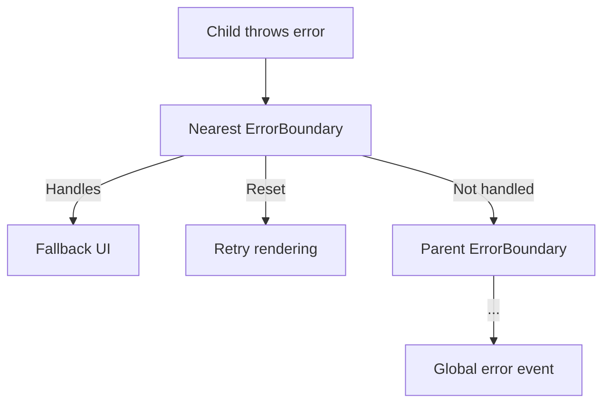

<!--
Copyright (c) 2024 Themba Mzumara
This file is part of SwissJS Framework. All rights reserved.
Licensed under the MIT License. See LICENSE in the project root for license information.
-->

# SwissJS Error Boundary System

SwissJS provides a comprehensive error boundary system for robust, resilient UI development. This system is inspired by React's error boundaries but is tailored to Swiss design principles: **minimalism, explicitness, and performance**.

---

## Key Features

1. **Comprehensive Error Catching**
   - Catches errors in all lifecycle phases (`init`, `mount`, `update`, `destroy`, etc.)
   - Catches errors in the `render()` method
   - Catches errors in plugin initialization and teardown
   - Prevents recursive error handling

2. **Error Boundary Component Pattern**
   - Use `<ErrorBoundary>` to wrap unstable components and provide a fallback UI
   - Errors in children are caught and do not crash the parent tree

   ```tsx
   <ErrorBoundary fallback={(error, reset) => (
     <div class="error-fallback">
       <h3>Something went wrong</h3>
       <p>{error.message}</p>
       <button on:click={reset}>Retry</button>
     </div>
   )}>
     <UnstableComponent />
   </ErrorBoundary>
   ```

3. **onError Lifecycle Hook**
   - Components can implement `onError(error, phase)` for custom error handling
   - Return `true` to prevent error propagation to parent boundaries

   ```tsx
   class SafeComponent extends SwissComponent {
     onError(error: any, phase: LifecyclePhase): boolean {
       this.fenestrate('logger.error', error);
       return true; // Prevent propagation
     }
     constructor(props) {
       super(props);
       this.on('error', this.handleError);
     }
     handleError = (error) => {
       // Alternative hook-based approach
     }
   }
   ```

4. **Recovery & Reset Mechanism**
   - Error boundaries expose `resetErrorBoundary()` to clear error state and retry rendering
   - Fallback UIs can provide a "Try Again" button

   ```tsx
   <button on:click={() => resetErrorBoundary()}>
     Try Again
   </button>
   ```

5. **Error Propagation**
   - Errors propagate up the component tree
   - Stopped by the nearest error boundary
   - Unhandled errors trigger global events (`swiss:global-error`)

6. **Error Context Propagation**
   - Parent boundaries can access child error info via context
   - Useful for analytics, logging, or custom fallback logic

---

## Usage Examples

### 1. Basic Error Boundary
```tsx
import { ErrorBoundary } from 'swiss';

const App = () => (
  <ErrorBoundary fallback={(error, reset) => (
    <div class="app-error">
      <h2>Application Error</h2>
      <p>{error.message}</p>
      <button on:click={reset}>Restart</button>
    </div>
  )}>
    <MainContent />
    <Footer />
  </ErrorBoundary>
);
```

### 2. Component with Error Handling
```tsx
class DataFetcher extends SwissComponent {
  state = { data: null, loading: true };
  async onMount() {
    try {
      const data = await this.fenestrate('api.fetchData');
      this.setState({ data, loading: false });
    } catch (error) {
      this.captureError(error, 'mount');
      this.setState({ loading: false });
    }
  }
  onError(error) {
    this.setState({ errorMessage: error.message });
    return true; // Prevent propagation
  }
  render() {
    if (this.state.loading) return <Spinner />;
    if (this.state.errorMessage) return <ErrorCard message={this.state.errorMessage} />;
    return <DataView data={this.state.data} />;
  }
}
```

### 3. HOC for Error Boundaries
```tsx
const SafeComponent = withErrorBoundary(
  UnstableComponent,
  (error, reset) => (
    <div class="component-error">
      <p>Component failed: {error.message}</p>
      <button on:click={reset}>Retry</button>
    </div>
  )
);
```

### 4. Functional Component with Error Boundary
```tsx
const FunctionalWithError = () => {
  const { error, resetError, ErrorBoundary } = useErrorBoundary();
  if (error) {
    return (
      <div class="error">
        <p>{error.message}</p>
        <button on:click={resetError}>Retry</button>
      </div>
    );
  }
  return (
    <ErrorBoundary fallback={(err, reset) => (
      <div>
        Child error: {err.message}
        <button on:click={reset}>Reset Child</button>
      </div>
    )}>
      <UnstableChildComponent />
    </ErrorBoundary>
  );
};
```

---

## Error Propagation Flow



- Errors bubble up the component tree
- Stopped by the nearest error boundary
- Unhandled errors trigger global error events

---

## Error State Management
- Each component maintains its own error state
- Error boundaries track child errors
- Reset mechanism clears error states and retries rendering

---

## Lifecycle Integration
- `safeRender()` wraps `render()` in try/catch
- All lifecycle methods are wrapped in try/catch
- Special `error` lifecycle phase for hooks

---

## Performance Considerations
- Errors do not trigger unnecessary re-renders
- Error boundaries prevent failed child rendering
- Reset mechanism is optimized for recovery

---

## API Reference

### ErrorBoundary Component
- `fallback: (error, reset) => VNode` — fallback UI renderer
- `resetErrorBoundary()` — resets error state

### SwissComponent Methods
- `captureError(error, phase)` — manually capture errors
- `resetErrorBoundary()` — reset error state
- `onError(error, phase)` — custom error handling (return true to stop propagation)

### HOC and Hook
- `withErrorBoundary(Component, fallback)` — wraps a component with an error boundary
- `useErrorBoundary()` — hook for functional components

---

## Conclusion

SwissJS error boundaries provide robust, flexible error handling for both class and functional components. They enable graceful recovery, custom fallback UIs, and seamless integration with the Swiss lifecycle and capability system.

SwissJS error boundaries: **Resilient. Predictable. Swiss.** 