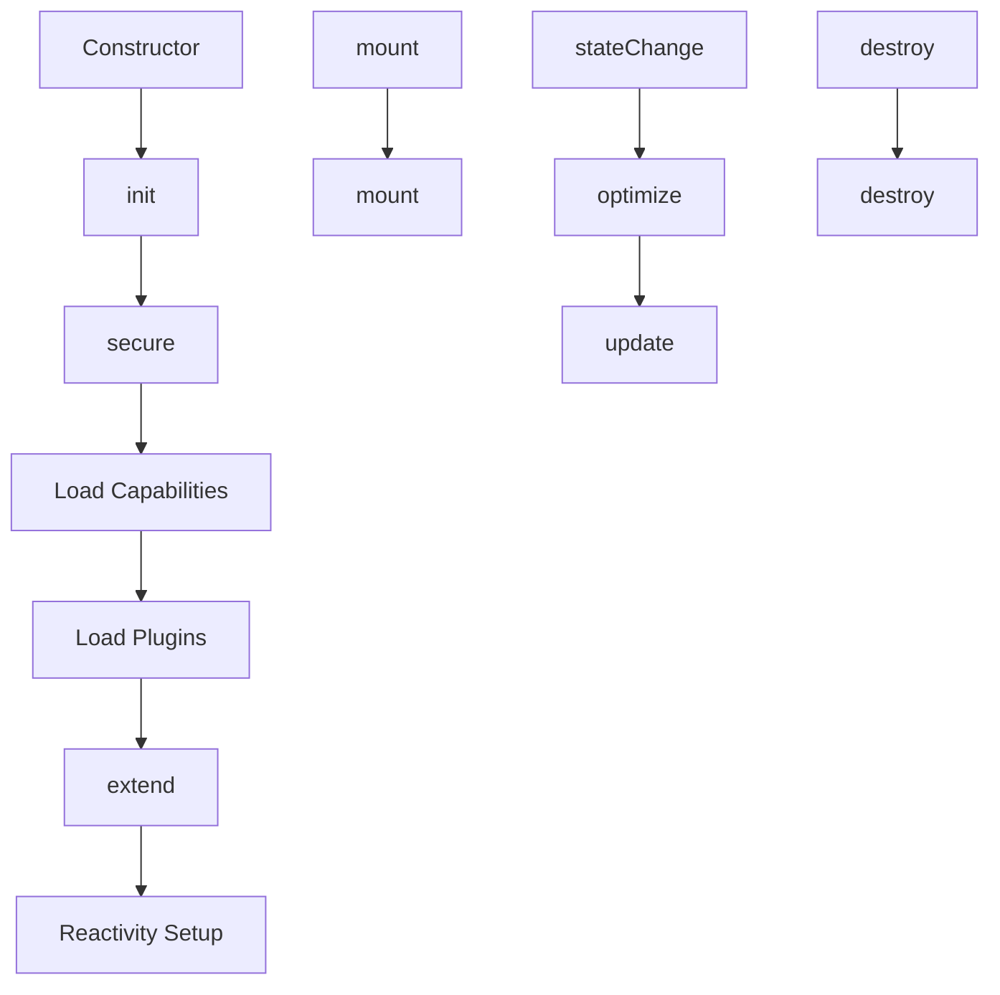

<!--
Copyright (c) 2024 Themba Mzumara
This file is part of SwissJS Framework. All rights reserved.
Licensed under the MIT License. See LICENSE in the project root for license information.
-->

# SwissJS Lifecycle Hooks System

SwissJS implements a sophisticated, minimal, and extensible lifecycle hook system inspired by Swiss design principles: **security, performance, and modularity**. This document details the available hooks, their roles, usage patterns, the unique Swiss .ui file format, and the underlying design philosophy.

---

## Core Lifecycle Hooks

| Hook      | Purpose                    | Triggered By                 | Example Use Case                       |
| --------- | -------------------------- | ---------------------------- | -------------------------------------- |
| `init`    | Component initialization   | Constructor (`initialize()`) | Setup state, pre-DOM logic             |
| `mount`   | Post-DOM insertion actions | Explicitly via `mount()`     | Add event listeners, DOM manipulation  |
| `update`  | State/prop change handling | Reactively via state change  | Fetch data, sync with external sources |
| `destroy` | Cleanup before removal     | Explicitly via `destroy()`   | Remove timers, listeners, free memory  |

### Usage Examples

```js
this.on("init", () => {
  this.state = { loading: true };
});

this.on("mount", () => {
  this._container.addEventListener("click", this.handleClick);
});

this.on("update", () => {
  if (this.state.pageChanged) this.fetchData();
});

this.on("destroy", () => {
  clearInterval(this.timerId);
});
```

---

## Specialized Swiss Hooks

| Hook       | Purpose                   | Triggered By                    | Example Use Case                      |
| ---------- | ------------------------- | ------------------------------- | ------------------------------------- |
| `secure`   | Security validations      | During `validateCapabilities()` | Check user roles, enforce permissions |
| `optimize` | Performance optimizations | In `performUpdate()`            | Prevent unnecessary re-renders        |
| `extend`   | Plugin integration point  | After plugin initialization     | Inject plugin APIs, extend component  |

### Usage Examples

```js
this.on(
  "secure",
  () => {
    if (!user.isAdmin) throw new Error("Access denied");
  },
  { capability: "auth" },
);

this.on("optimize", () => {
  if (shallowEqual(this.prevProps, this.props)) cancelUpdate();
});

this.on("extend", () => {
  this.pluginAPI = this.fenestrate("plugin-loader");
});
```

---

## Swiss .ui File Format & Terminology

SwissJS introduces a unique `.ui` file format and terminology, differentiating it from React/Vue/Angular while maintaining developer familiarity.

### Example: login.ui

```swiss
// login.ui
import { component, fenestrate, useReactive, useLifecycle, useCapability } from 'swiss';

// Fenestration declarations (capabilities)
@fenestrate(['auth', 'i18n', 'analytics'])
@component
class LoginForm extends SwissComponent {
  // Reactive state
  state = {
    email: '',
    password: '',
    loading: false
  };

  // Lifecycle hooks
  onMount() {
    this.trackEvent('login_viewed');
  }

  // Custom method with fenestration
  handleSubmit = async () => {
    this.setReactive({ loading: true });
    try {
      const auth = this.access('auth');
      await auth.login(this.state.email, this.state.password);
      this.emit('login-success');
    } catch (error) {
      this.trigger('login-error', error);
    } finally {
      this.setReactive({ loading: false });
    }
  };

  // Render method
  render() {
    const { t } = this.access('i18n');
    return (
      <form on:submit={this.handleSubmit}>
        <h2>{t('login_title')}</h2>
        <input
          type="email"
          bind:value={this.state.email}
          placeholder={t('email_placeholder')}
        />
        <input
          type="password"
          bind:value={this.state.password}
          placeholder={t('password_placeholder')}
        />
        <button type="submit" disabled={this.state.loading}>
          {this.state.loading ? t('loading') : t('login_button')}
        </button>
      </form>
    );
  }
}

// Functional component alternative
export default function LoginWidget(props) {
  // Reactive state (Swiss version of useState)
  const [credentials, setCredentials] = useReactive({
    email: '',
    password: ''
  });

  // Capability access
  const auth = useCapability('auth');
  const analytics = useCapability('analytics');
  const { t } = useCapability('i18n');

  // Lifecycle hooks (Swiss version of useEffect)
  useLifecycle({
    onMount: () => analytics.track('login_widget_mounted'),
    onUpdate: (prev) => {
      if (credentials.email !== prev.credentials.email) {
        analytics.track('email_changed');
      }
    },
    onDestroy: () => console.log('Login widget unmounted')
  });

  const handleSubmit = async () => {
    await auth.login(credentials.email, credentials.password);
    props.onLoginSuccess?.();
  };

  return (
    <div class="login-widget">
      <LoginForm />
      <div class="alternative-login">
        <button on:click={props.onOAuthRequest}>
          {t('oauth_login')}
        </button>
      </div>
    </div>
  );
}
```

### Key Swiss Terminology

1. **Reactivity**
   - `useReactive()` instead of `useState()`
   - `setReactive()` instead of `setState()`
   - `bind:value` for two-way data binding

2. **Lifecycle**
   - `useLifecycle()` instead of `useEffect()`
   - Structured with explicit phases:
     ```js
     useLifecycle({
       onMount: () => {...},
       onUpdate: (prevState) => {...},
       onDestroy: () => {...}
     })
     ```

3. **Capabilities (Fenestration)**
   - `@fenestrate()` decorator for class components
   - `useCapability()` hook for functional components
   - `access()` method for class capability retrieval

4. **Event System**
   - `on:event` syntax for DOM events
   - `emit()` for custom events
   - `trigger()` for error events

5. **Component Decorators**
   - `@component` marks UI components
   - `@fenestrate` declares required capabilities

### File Structure Conventions

1. **Single File Component**
   - Combines logic, markup, and styling
   - `.ui` file extension

2. **Top-to-Bottom Structure**
   - Capability declarations
   - Class components (optional)
   - Main functional component (default export)
   - Utility functions

3. **Reactive Bindings**

   ```swiss
   <input bind:value={state.email}>
   ```

   Automatically syncs state with DOM

4. **Scoped Styling (Example)**

   ```swiss
   <style scoped>
   .login-widget {
    padding: 2rem;
    border: 1px solid var(--border);
   }
   </style>
   ```

   Automatically scoped to component

5. **Dependency Management**
   ```swiss
   @fenestrate(['auth', 'i18n'])
   ```
   Explicit capability requirements

### Compilation Output

Swiss files would compile to:

```js
// login.swiss.js
import { SwissComponent, createElement, ... } from 'swiss';

class LoginForm extends SwissComponent {
  static fenestrations = ['auth', 'i18n', 'analytics'];

  constructor() {
    super({ fenestrations: ['auth', 'i18n', 'analytics'] });
    this.state = /* reactive proxy */;
  }

  // ... rest of implementation
}

function LoginWidget(props) {
  // ... compiled implementation
}

export default LoginWidget;
```

### Advantages Over Other Frameworks

1. **Explicit Capability System**
   - Runtime validation of dependencies
   - Better error messages for missing capabilities

2. **Unified Lifecycle Handling**
   - Single `useLifecycle` hook with named phases
   - Class and functional consistency

3. **Reactive Bindings**
   - Native two-way binding without wrappers
   - Scoped to components

4. **Swiss-Specific Terminology**
   - `Fenestrate` for capability management
   - `Reactive` instead of generic "state"
   - `Access` instead of context or services

5. **Error Resilience**
   - Built-in error boundaries
   - Capability fallback handling

This design maintains Swiss principles of **explicit dependencies**, **structured lifecycle**, and **performance focus** while providing a distinct developer experience that differs from React/Vue/Angular conventions.

---

## Hook Registration

Register hooks using a single, minimalist API:

```js
this.on(hookName, callback, {
  once: true, // Run once then auto-remove
  priority: 100, // Higher executes first
  capability: "ssr", // Only run if capability exists
});
```

- **`once`**: If true, hook is removed after first execution.
- **`priority`**: Higher values run first (default: 0).
- **`capability`**: Only run if the component has this capability.

---

## Execution Flow



- **init**: Runs during construction.
- **secure**: Runs before loading capabilities.
- **extend**: Runs after plugins are loaded.
- **mount**: Runs when `mount()` is called.
- **optimize/update**: Run on state changes.
- **destroy**: Runs when `destroy()` is called.

---

## Reactivity Integration

- State changes trigger `scheduleUpdate()` → `requestAnimationFrame` → `optimize`/`update` hooks → re-render.

---

## Capability & Plugin System

- Hooks can be gated by capabilities (e.g., `{ capability: 'geo' }`).
- Plugins can inject hooks during `loadPlugins()`.

---

## Swiss Design Principles in Action

1. **Minimalist API**: Single `.on()` method for all lifecycle phases.
2. **Performance First**: Update batching via `requestAnimationFrame`, `optimize` hook for update prevention.
3. **Modular Security**: `secure` hook separates security from core logic.
4. **Extensibility**: `extend` hook formalizes plugin integration.

---

## Example: Authentication Hook

```js
this.on(
  "secure",
  async () => {
    const auth = this.fenestrate("auth");
    if (!(await auth.isLoggedIn())) {
      throw new Error("Authentication required");
    }
  },
  { capability: "auth", priority: 1000 },
);
```

---

## Summary Table

| Hook       | When Triggered                | Typical Use Case               |
| ---------- | ----------------------------- | ------------------------------ |
| `init`     | Constructor                   | State setup, pre-DOM logic     |
| `secure`   | Capability validation         | Auth, permissions, roles       |
| `extend`   | After plugin initialization   | Plugin APIs, extensions        |
| `mount`    | On `mount()`                  | DOM listeners, 3rd-party libs  |
| `optimize` | Before update on state change | Prevent unnecessary re-renders |
| `update`   | On state/prop change          | Data fetch, sync, animation    |
| `destroy`  | On `destroy()`                | Cleanup, remove listeners      |

---

## Why Swiss Lifecycle Hooks Matter

- **Predictable**: Ensures code runs at the right time.
- **Performant**: Enables batching and optimization.
- **Modular**: Clean separation of concerns (security, plugins, rendering).
- **Extensible**: Plugins and global hooks are first-class citizens.
- **Async-Friendly**: All hooks can be async.

---

## Migration/Adoption Plan

1. Refactor components to use `.on()` for lifecycle logic.
2. Use `secure` and `extend` for security and plugin integration.
3. Use `optimize` for performance-sensitive updates.
4. Document and share best practices for hook usage.

---

## Further Reading

- [SwissComponent Implementation](../src/component/component.ts)
- [Swiss Design Principles](https://en.wikipedia.org/wiki/Swiss_Style)
- [Modern Web Frameworks: React, Vue, Angular]

---

SwissJS lifecycle hooks: **Minimal. Secure. Performant. Extensible.**
